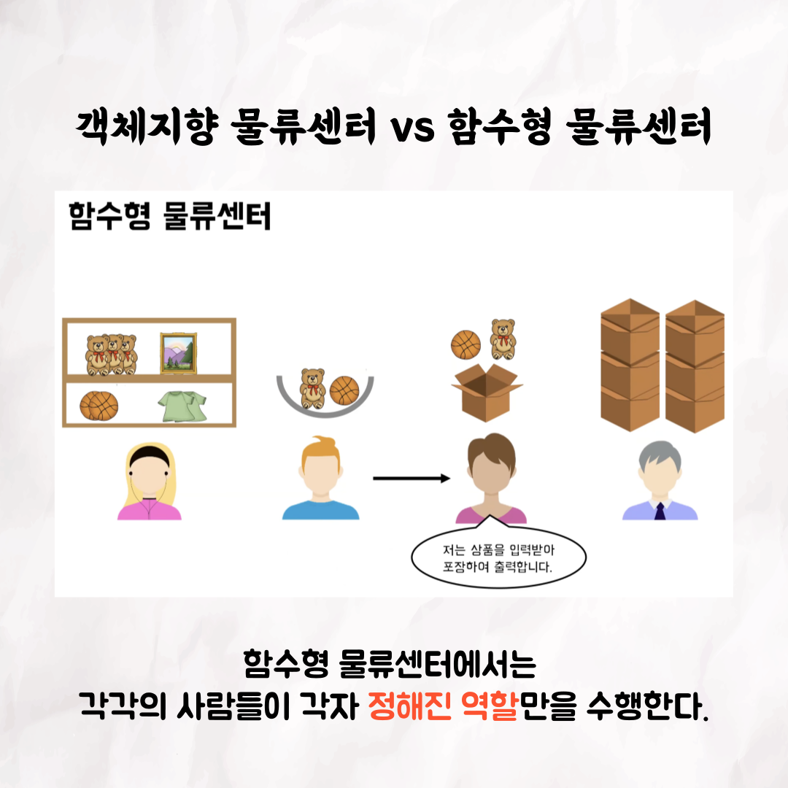
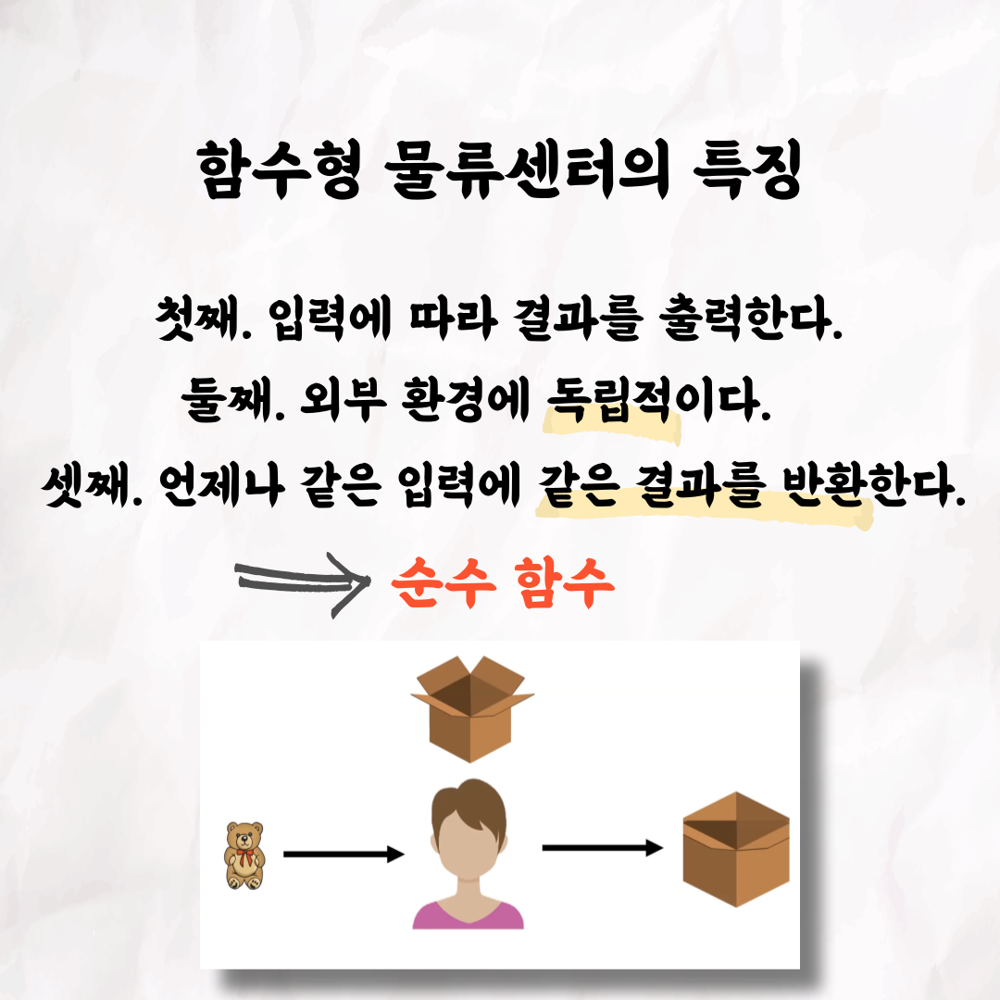
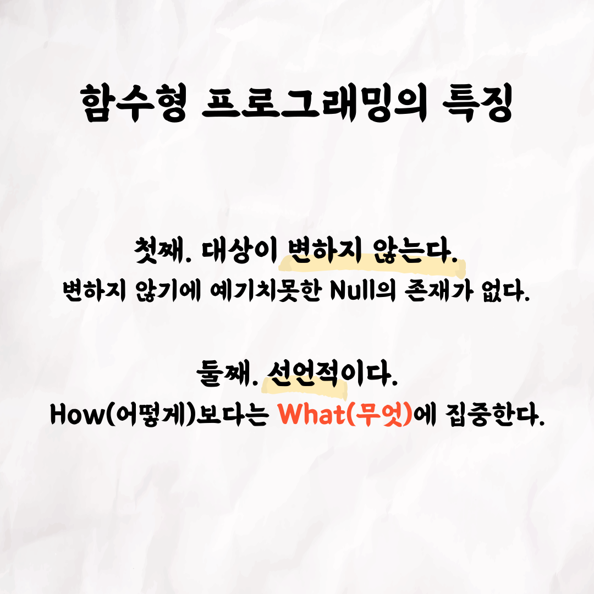

📮 테코톡

주제: 함수형 프로그래밍

발표자: 레오

함수형 프로그래밍과 객체지향 프로그래밍의 차이는 무엇일까요?
또한, 함수형 프로그래밍만이 가지는 장점은 무엇일까요?! 🤔

레오의 테코톡에 이 질문들에 대한 답이 있습니다!

영상은 유튜브에 "레오의 함수형 프로그래밍"으로 검색하시면 찾아보실 수 있습니다 😄

우아한Tech 유튜브:https://www.youtube.com/c/%EC%9A%B0%EC%95%84%ED%95%9CTech

우아한테크코스 홈페이지:https://woowacourse.github.io

우테코 블로그(Tecoble):https://tecoble.techcourse.co.kr

#우아한테크코스#우테코#테코톡#개발자#java#javascript#spring#react#개발문화#개발#개발자#woowahantechcourse#wooteco#techcourse
