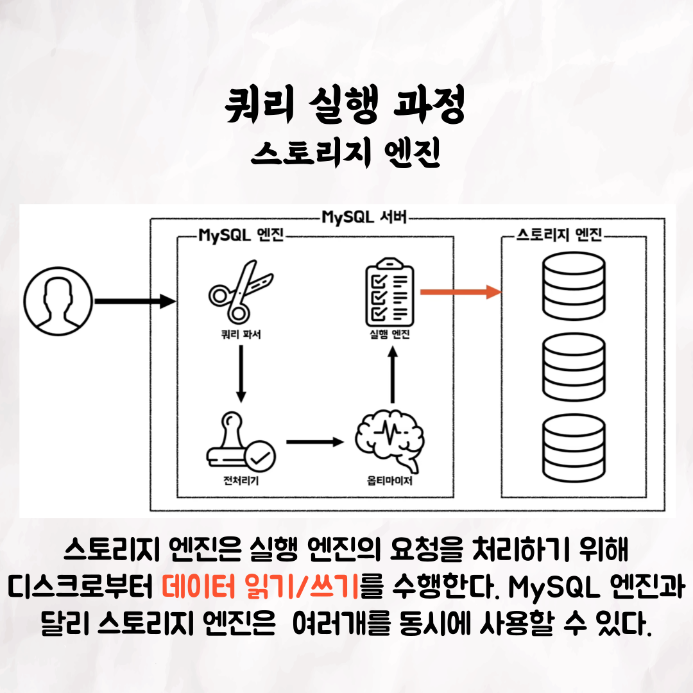

### 테코톡 - 릭의 MySQL 아키텍처

📮 테코톡

주제: MySQL 아키텍처

발표자: 릭 🦉

우리가 쿼리를 실행하게 되면 MySQL 내부에서는 어떤 일들이 벌어지는 걸까요?  
쿼리 실행 과정을 하나하나 살펴보면서 함께 MySQL 아키텍처에 대해 공부해보아요 🙌

영상은 유튜브에 "릭의 MySQL 아키텍처"로 검색하시면 찾아보실 수 있습니다!

우아한Tech 유튜브:https://www.youtube.com/c/%EC%9A%B0%EC%95%84%ED%95%9CTech

우아한테크코스 홈페이지:https://woowacourse.github.io

우테코 블로그(Tecoble):https://tecoble.techcourse.co.kr

#우아한테크코스 #우테코 #테코톡 #tecotalk #java #javascript #spring #react #개발문화 #개발 #개발자 #woowahantechcourse #wooteco #techcourse #함께자라기 #MySQL
