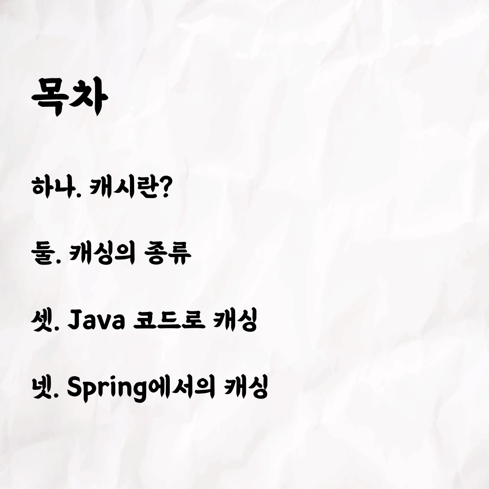
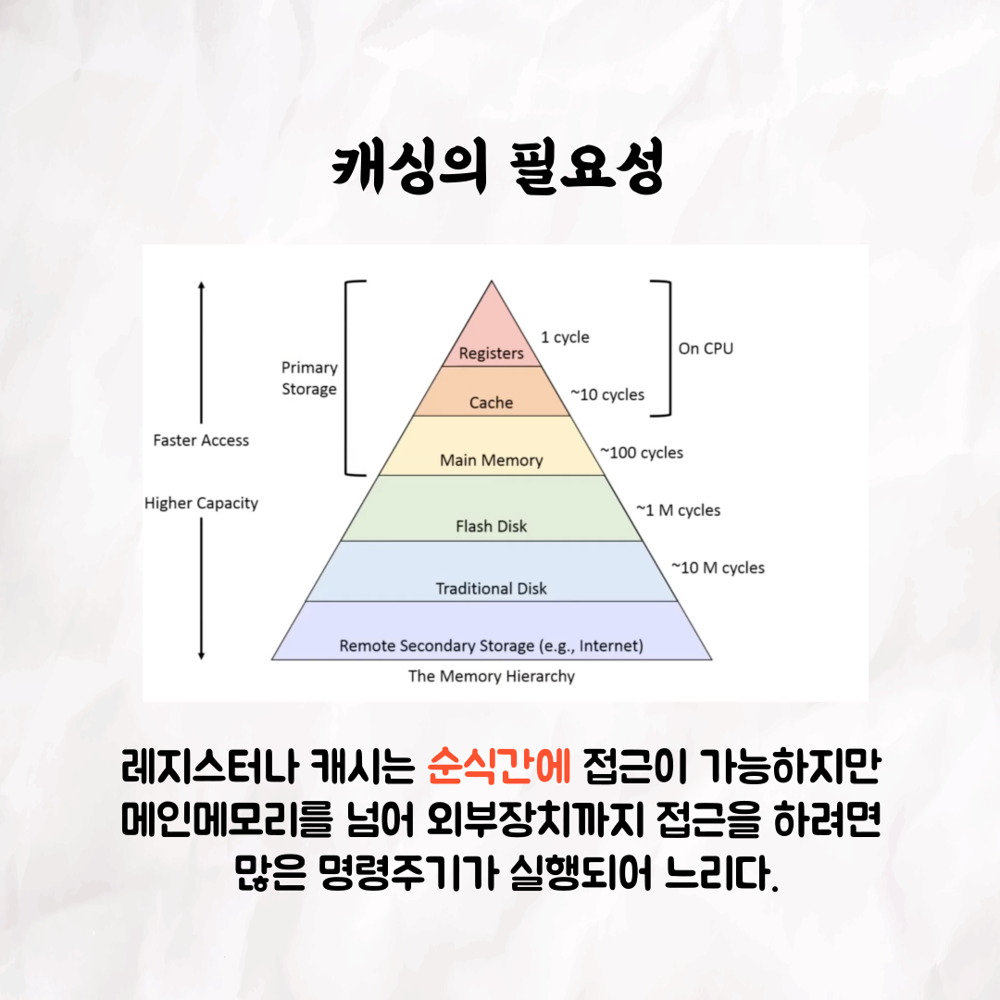
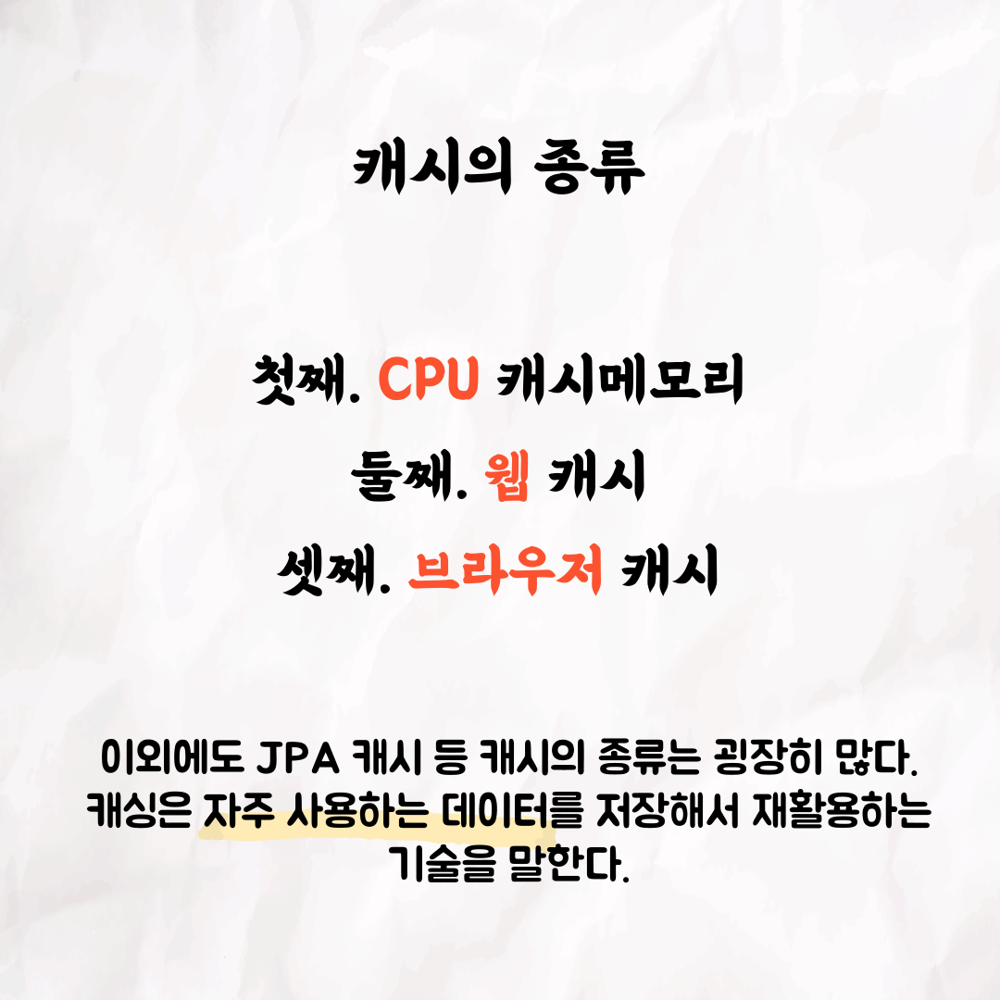
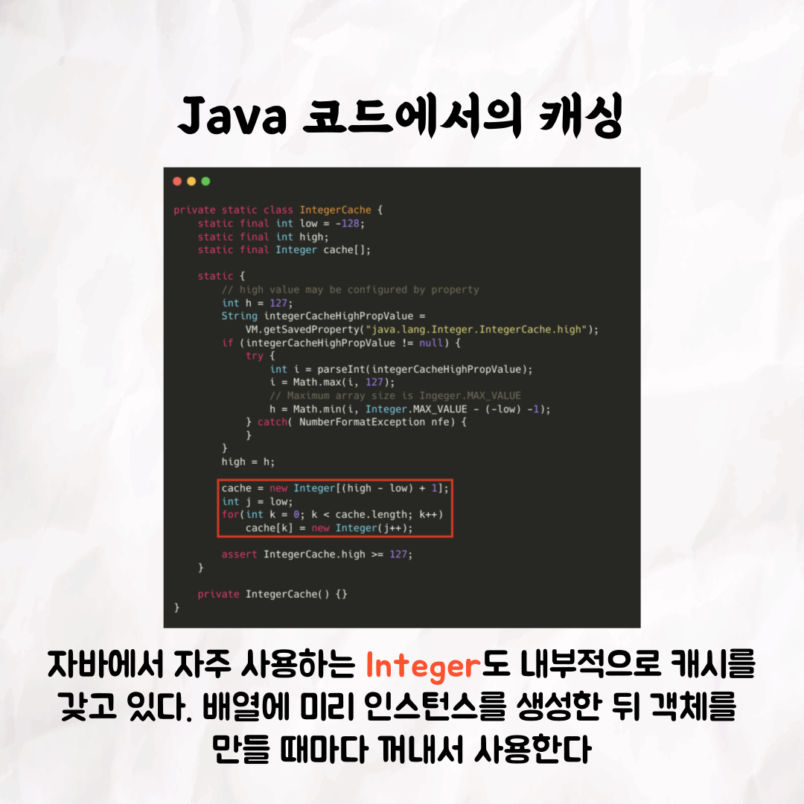
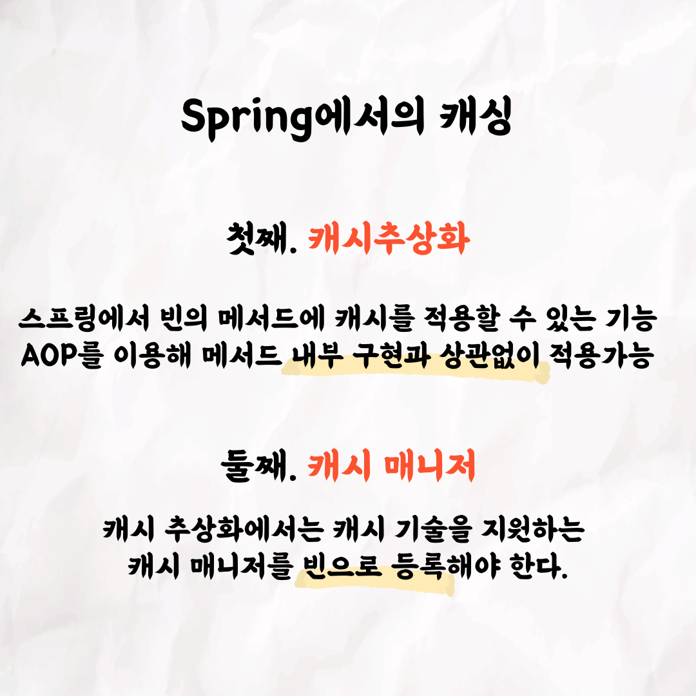
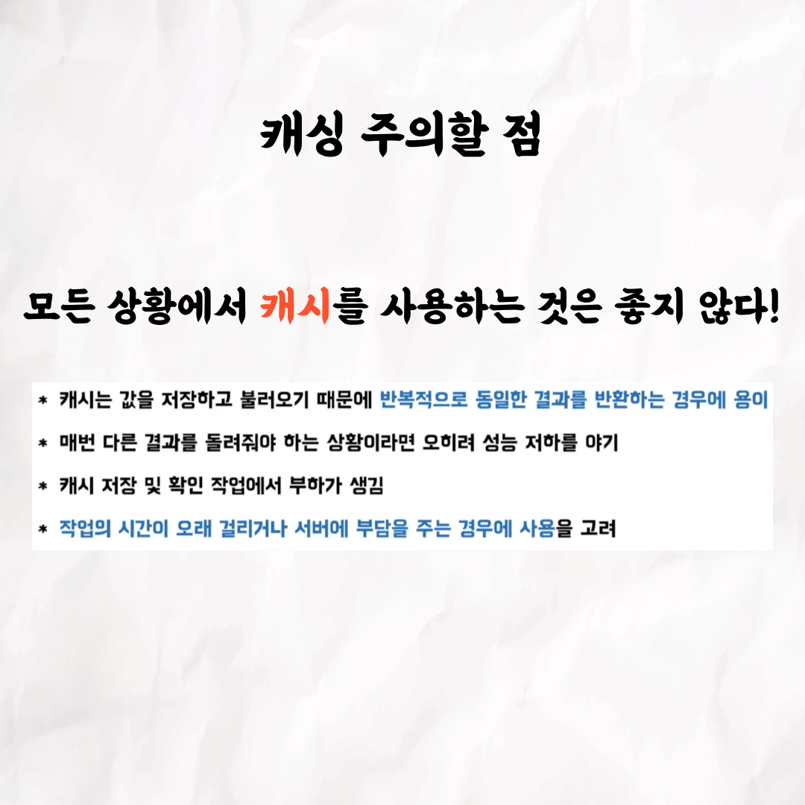

### 테코톡 - 썬의 캐싱

📮 테코톡

주제: 캐싱

발표자: 썬☀️

캐시는 많은 곳에서 사용되지만 각각 의미하는 바는 조금씩 다른데요,

이번 테코톡에서는 썬이 이 주제에 대해 언제, 어떻게 사용되는지에 대해 설명해주었습니다❗

영상을 통해 캐싱에 대해 함께 공부해보는건 어떨까요?

영상은 유튜브에 "썬의 캐싱"으로 검색하시면 찾아보실 수 있습니다

우아한Tech 유튜브:https://www.youtube.com/c/%EC%9A%B0%EC%95%84%ED%95%9CTech

우아한테크코스 홈페이지:https://woowacourse.github.io

우테코 블로그(Tecoble):https://tecoble.techcourse.co.kr

#우아한테크코스 #우테코 #테코톡 #tecotalk #java #javascript #spring #react #개발문화 #개발 #개발자 #woowahantechcourse #wooteco #techcourse #함께자라기 #캐싱
