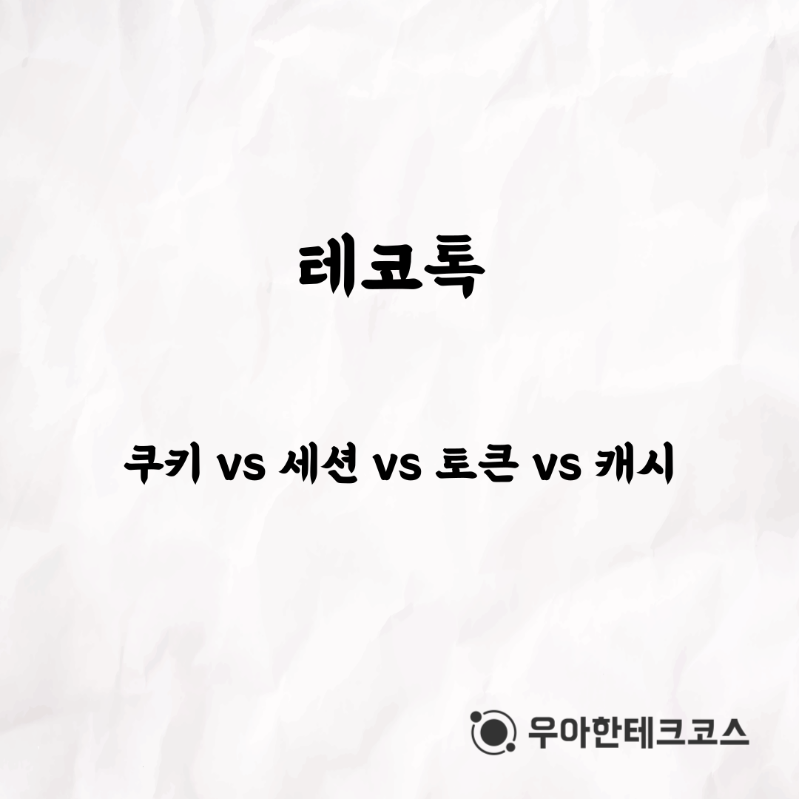
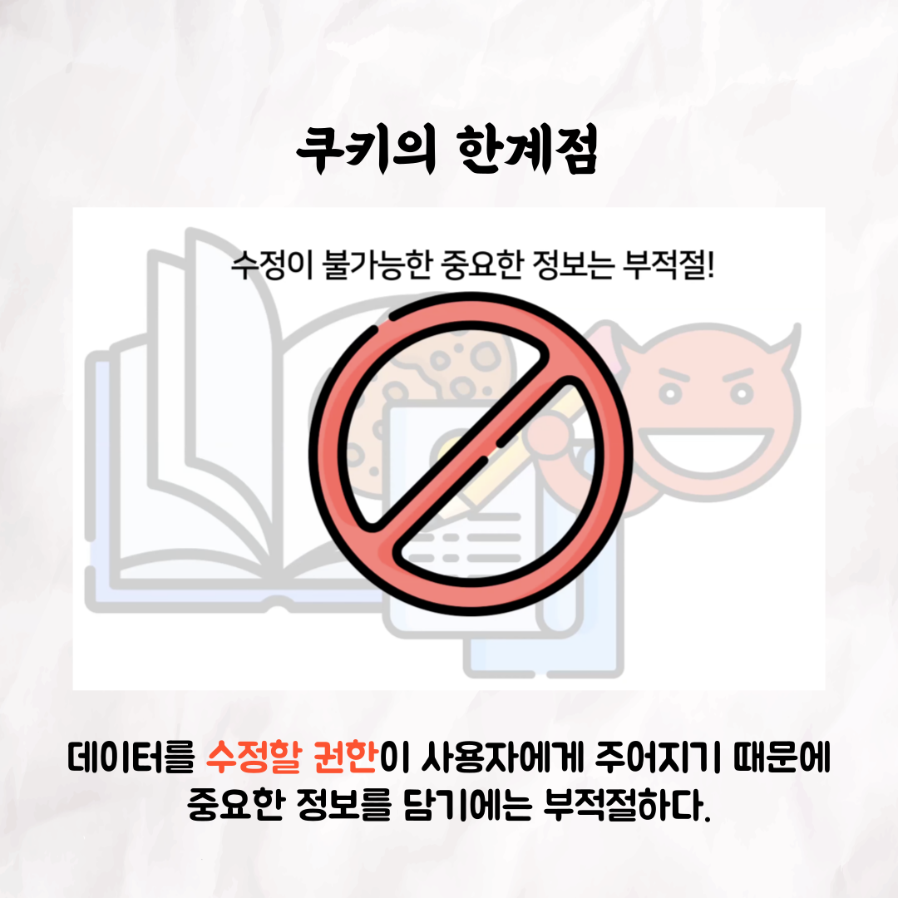
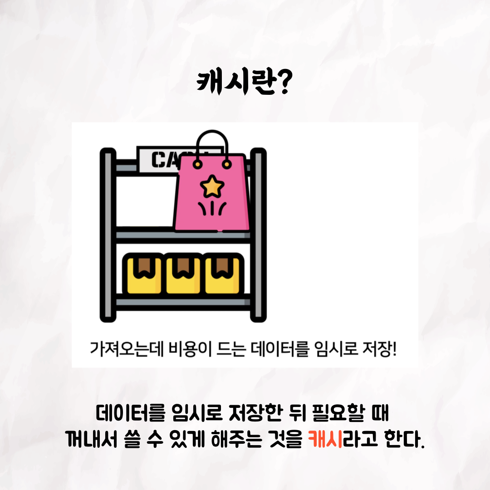

### 테코톡 - 연로그의 쿠키 vs 세션 vs 토큰 vs 캐시

📮 테코톡

주제: 쿠키 vs 세션 vs 토큰 vs 캐시

발표자: 연로그😎

쿠키, 세션, 토큰, 캐시...

자주 등장하는 개념이지만 어려운 네트워크 용어들 때문에 이해하기 어렵지 않으셨나요?  

그런 분들을 위한 테코톡 영상입니다❗

영상은 유튜브에 "연로그의 쿠키 vs 세션 vs 토큰 vs 캐시"로 검색하시면 찾아보실 수 있습니다

우아한Tech 유튜브:https://www.youtube.com/c/%EC%9A%B0%EC%95%84%ED%95%9CTech

우아한테크코스 홈페이지:https://woowacourse.github.io

우테코 블로그(Tecoble):https://tecoble.techcourse.co.kr

#우아한테크코스#우테코#테코톡#개발자#java#javascript#spring#react#개발문화#개발#개발자#woowahantechcourse#wooteco#techcourse
