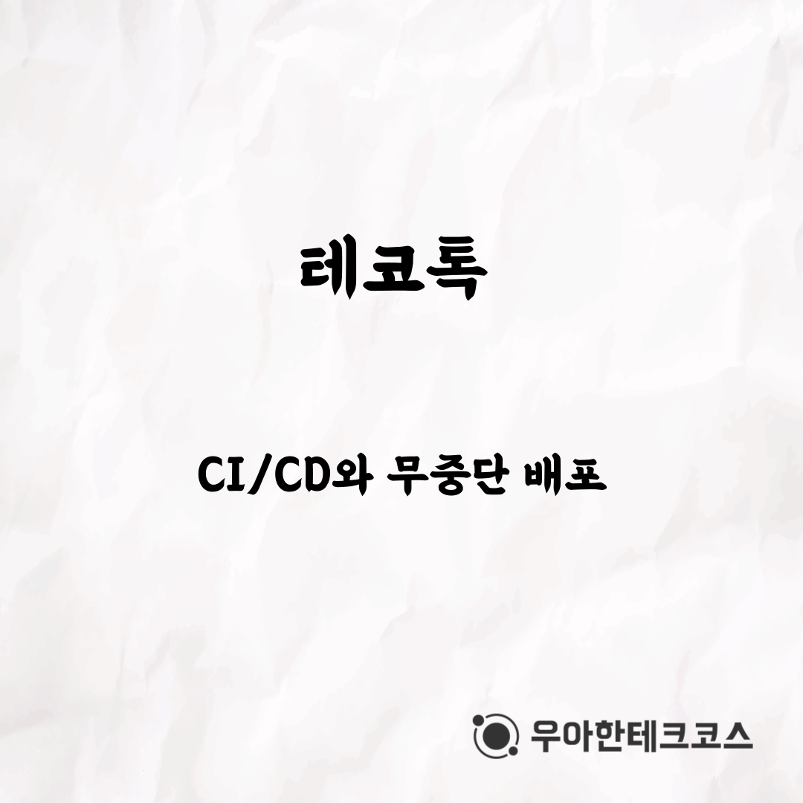
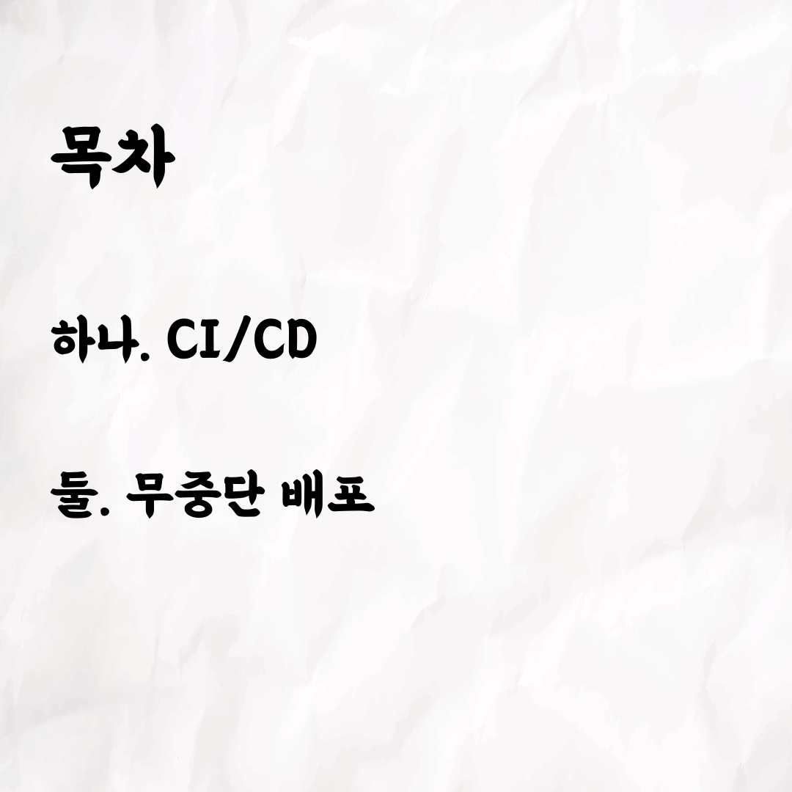
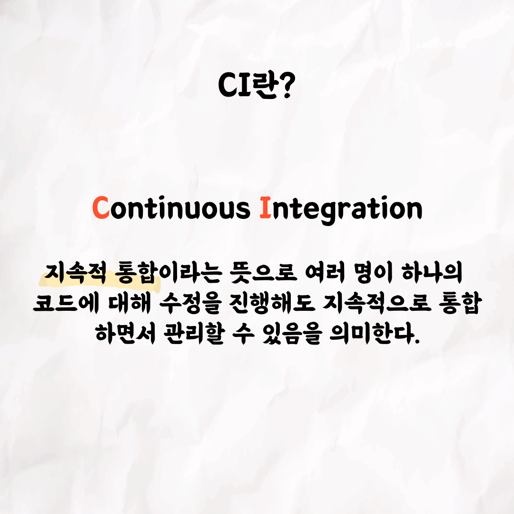
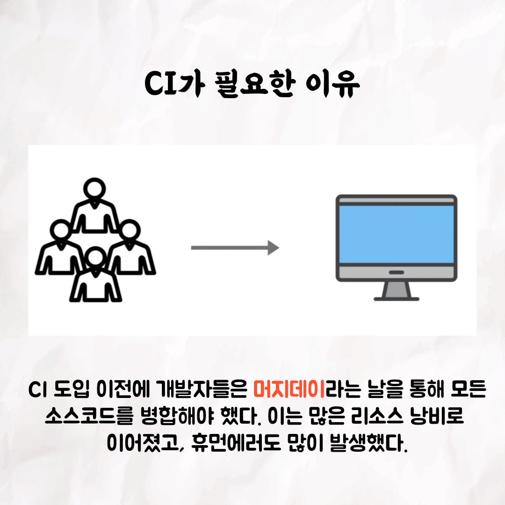
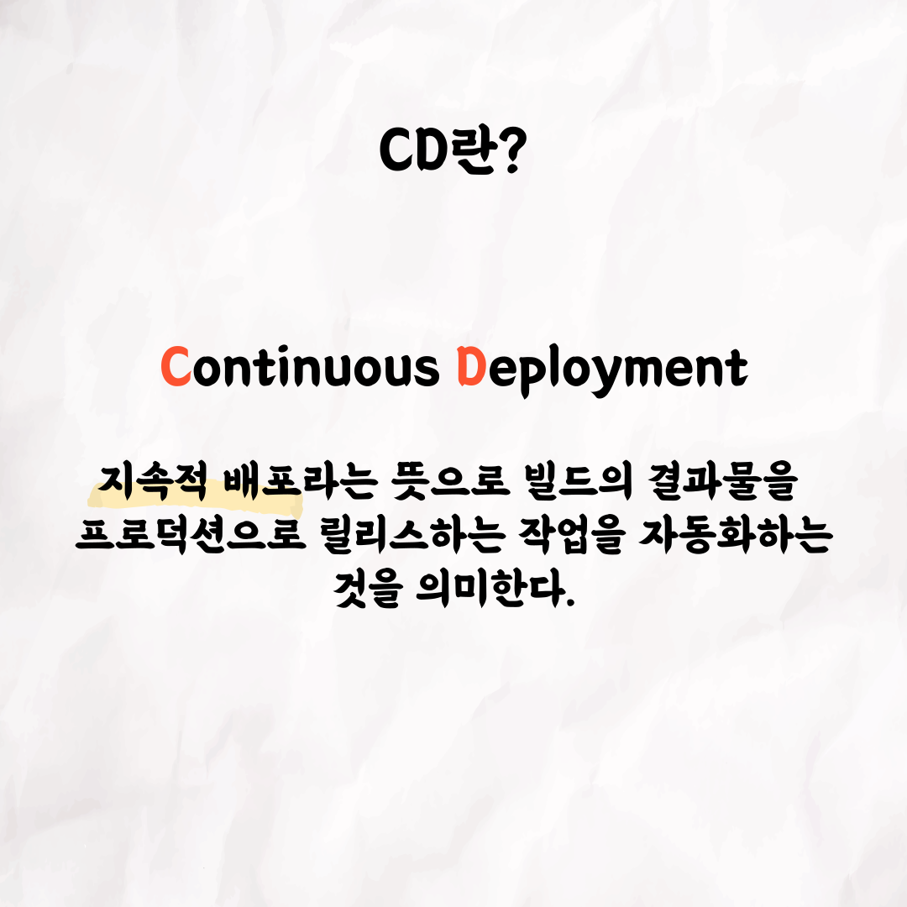
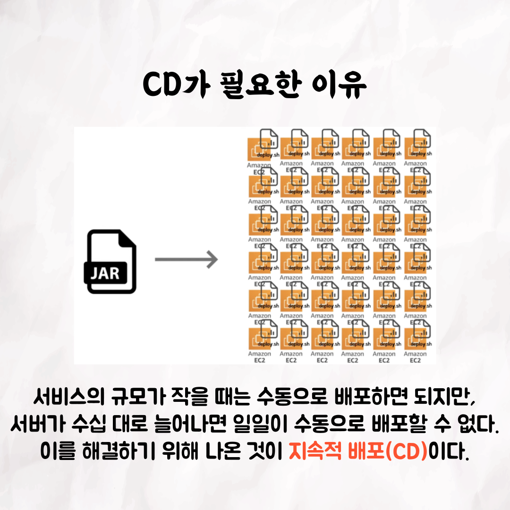
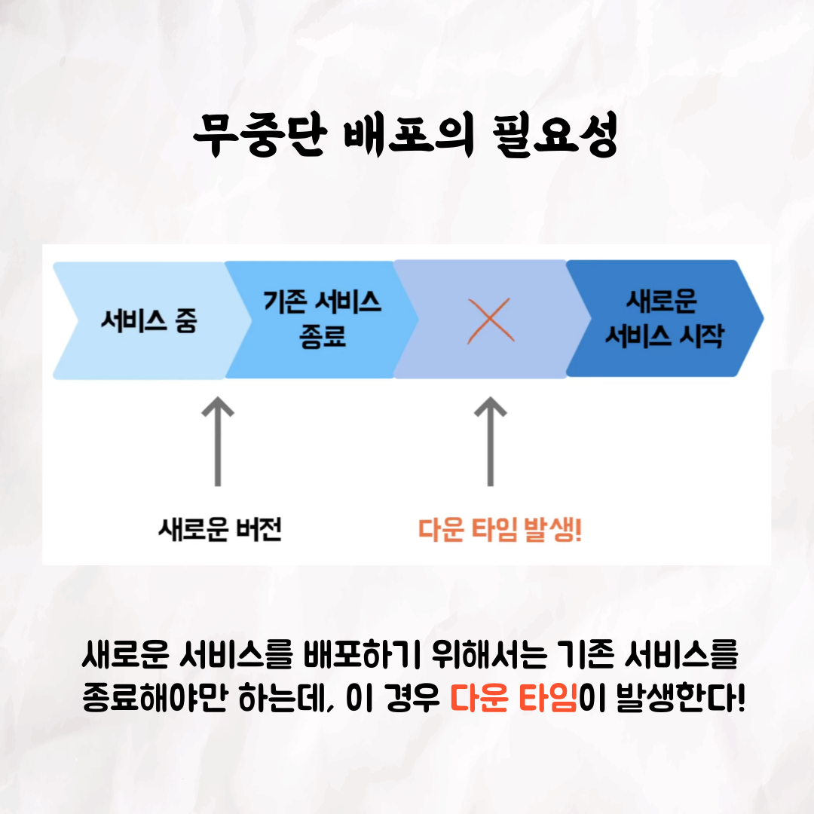
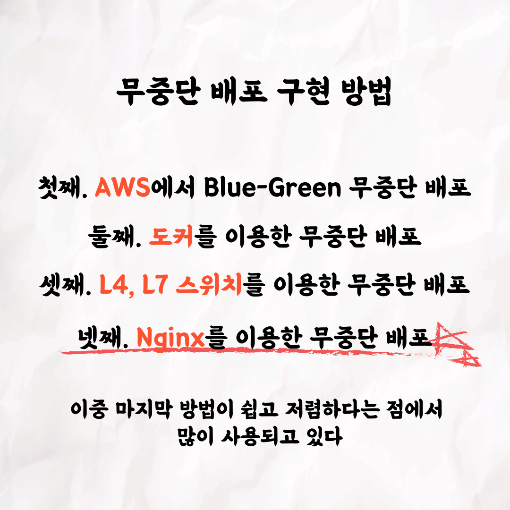
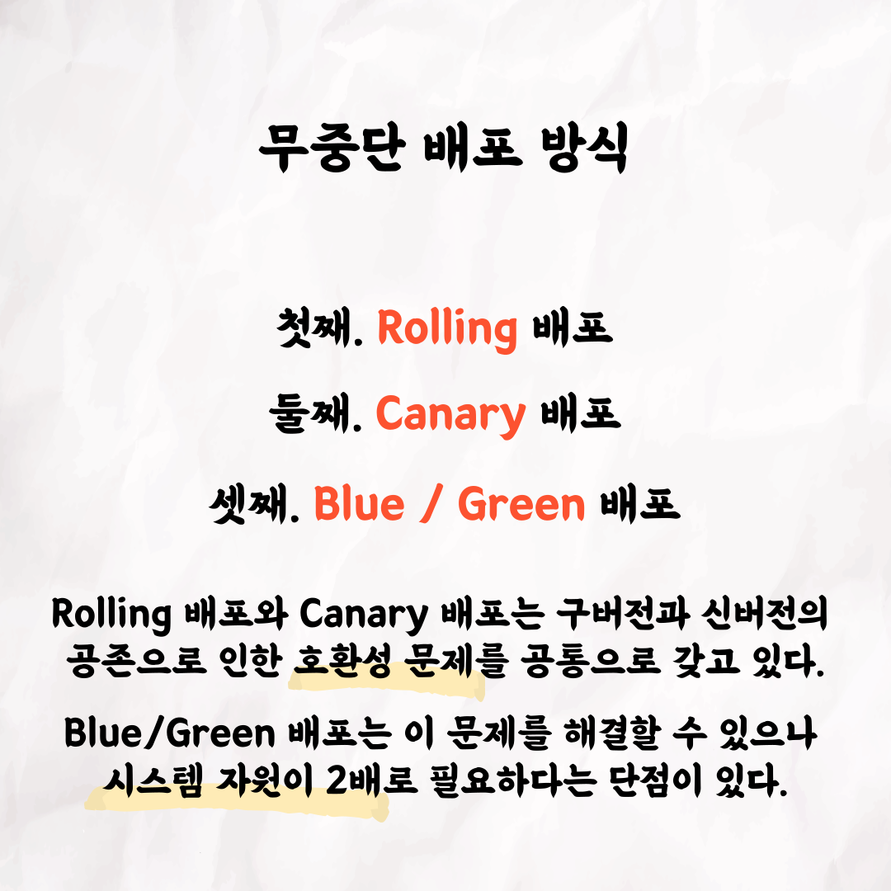
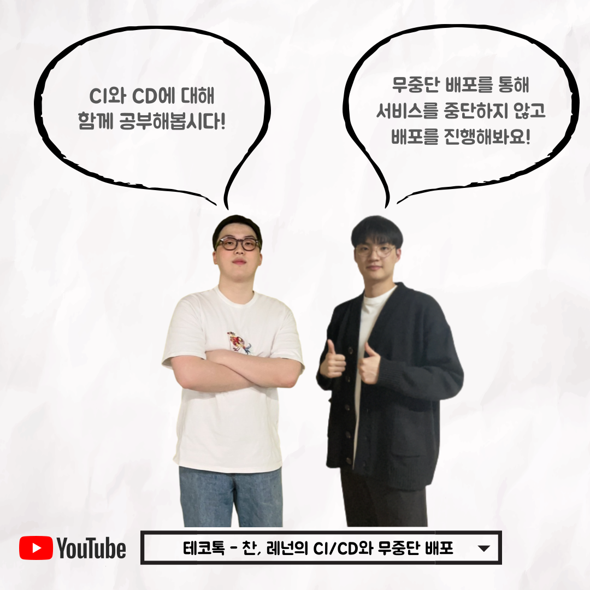

### 테코톡 - 찬 & 레넌의 CI/CD와 무중단 배포

📮 테코톡

주제: CI/CD와 무중단 배포

발표자: 찬🤩, 레넌🤠

서비스를 운영하다보면 마주할 수 밖에 없는 주제들이 있는데요,  

그런 주제 중 대표적인 것이 바로 CI/CD와 무중단 배포입니다.    

이번 테코톡은 이런 키워드들에 대해 대략적인 개념 정도만 알고 자세하게는 모르는 분들을 위해 준비한 영상입니다❗  

영상은 유튜브에 "찬&레넌의 CI/CD와 무중단 배포"로 검색하시면 찾아보실 수 있습니다

우아한Tech 유튜브:https://www.youtube.com/c/%EC%9A%B0%EC%95%84%ED%95%9CTech

우아한테크코스 홈페이지:https://woowacourse.github.io

우테코 블로그(Tecoble):https://tecoble.techcourse.co.kr

#우아한테크코스#우테코#테코톡#개발자#java#javascript#spring#react#개발문화#개발#개발자#woowahantechcourse#wooteco#techcourse
