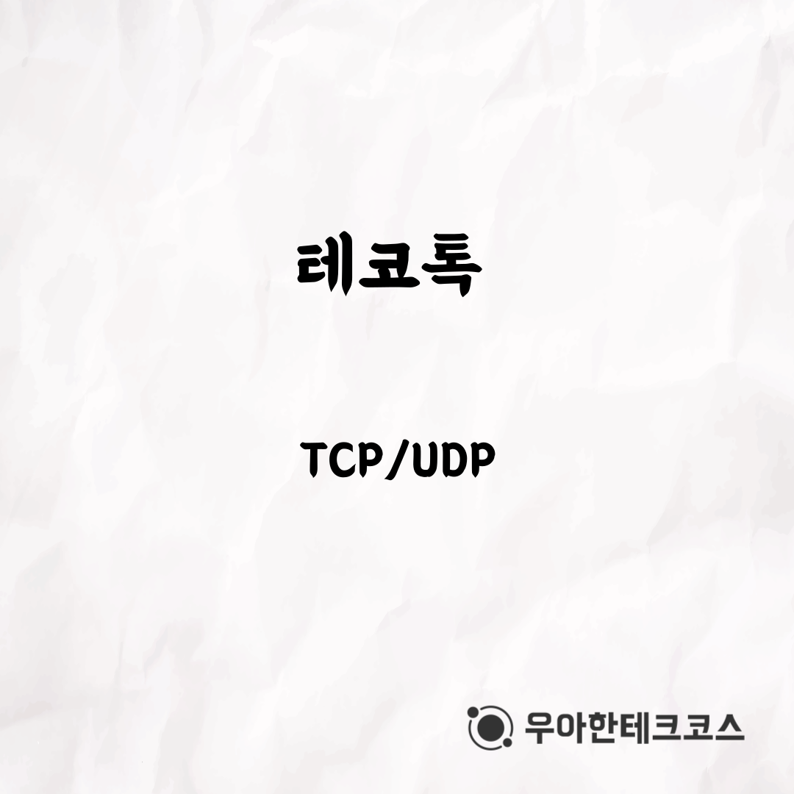
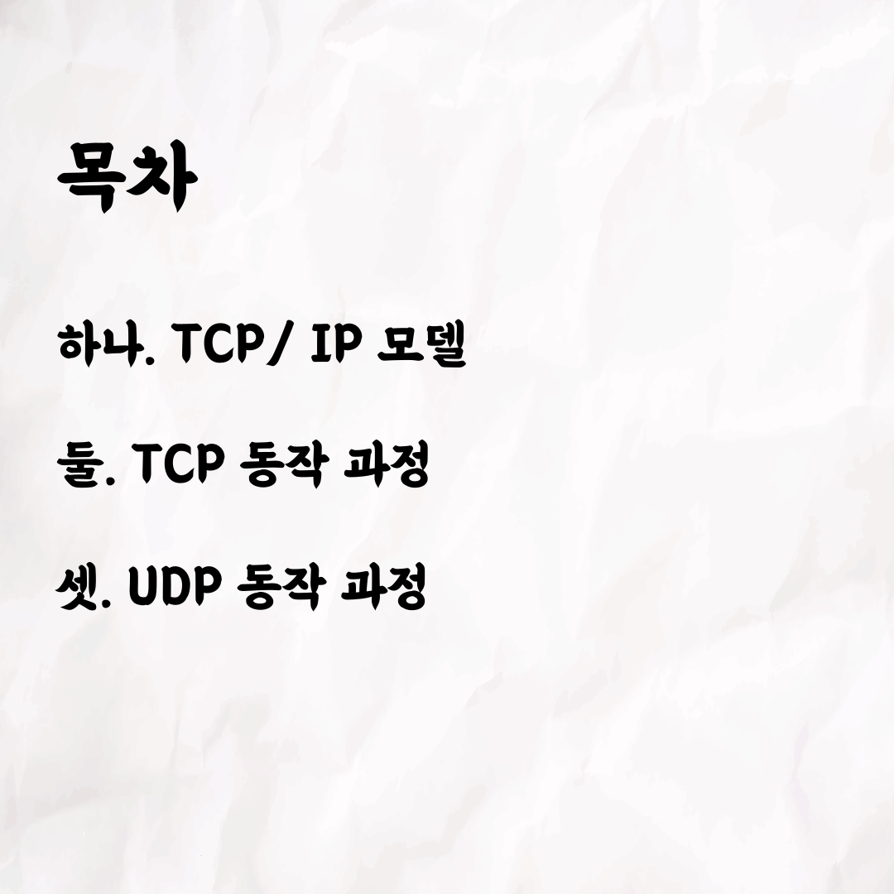
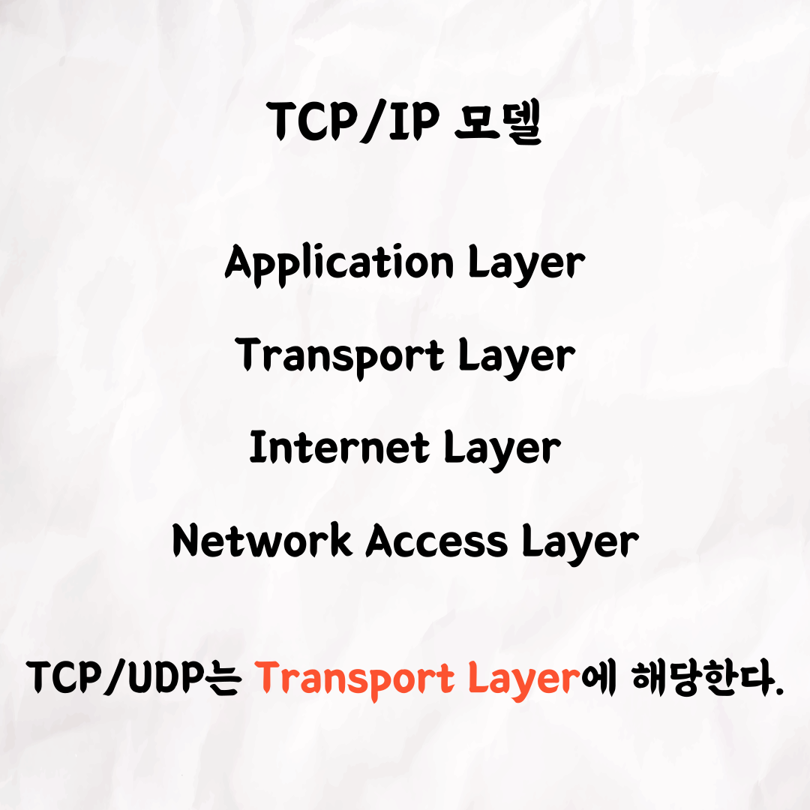
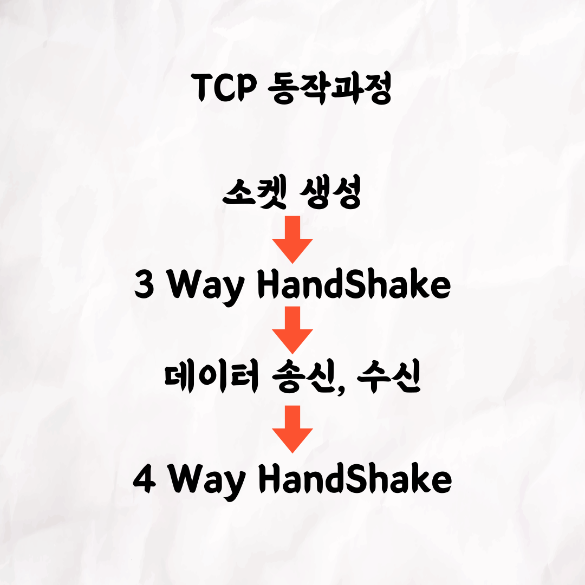
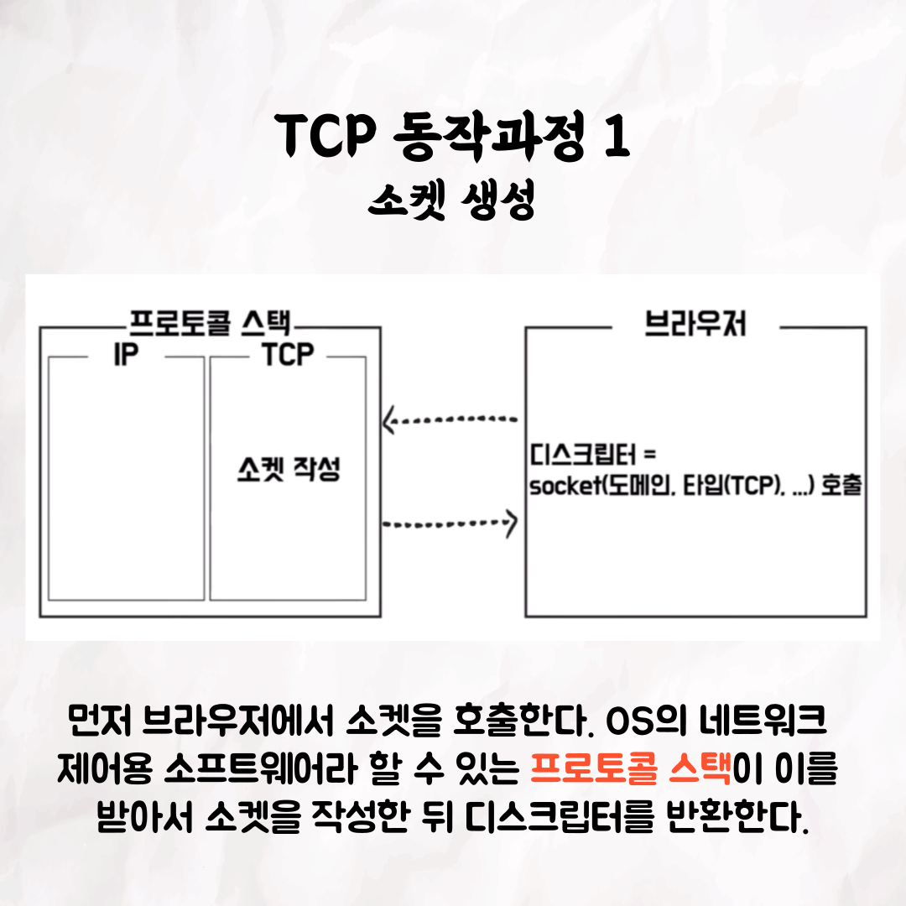
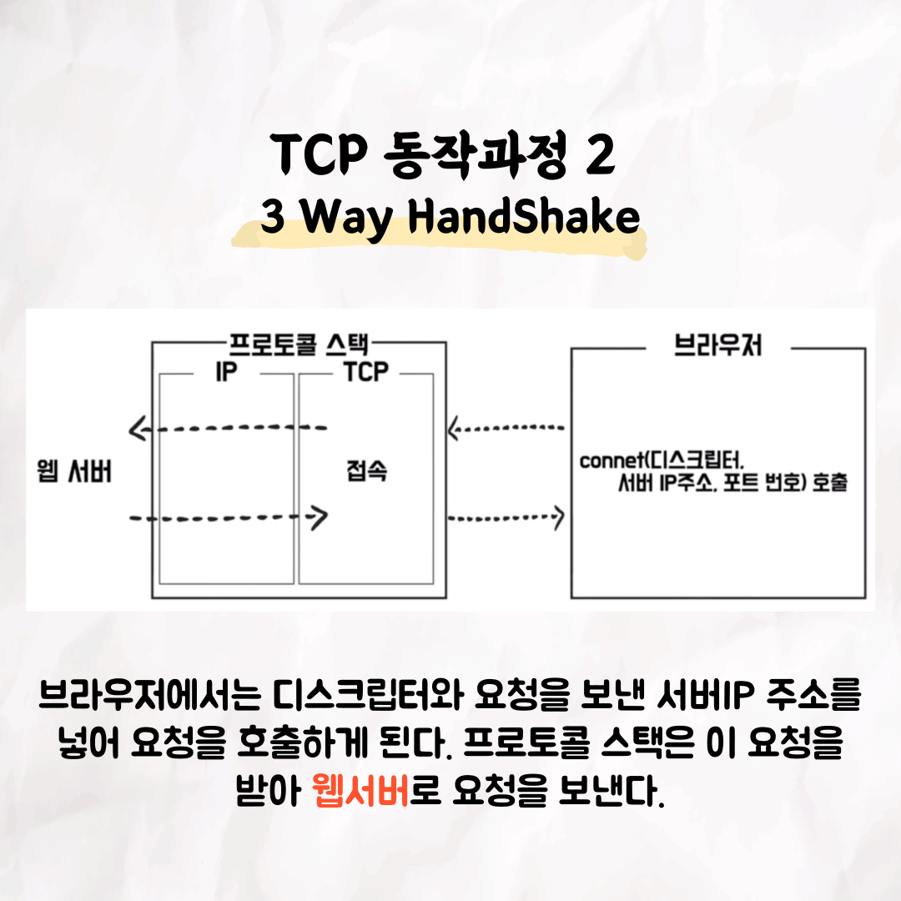
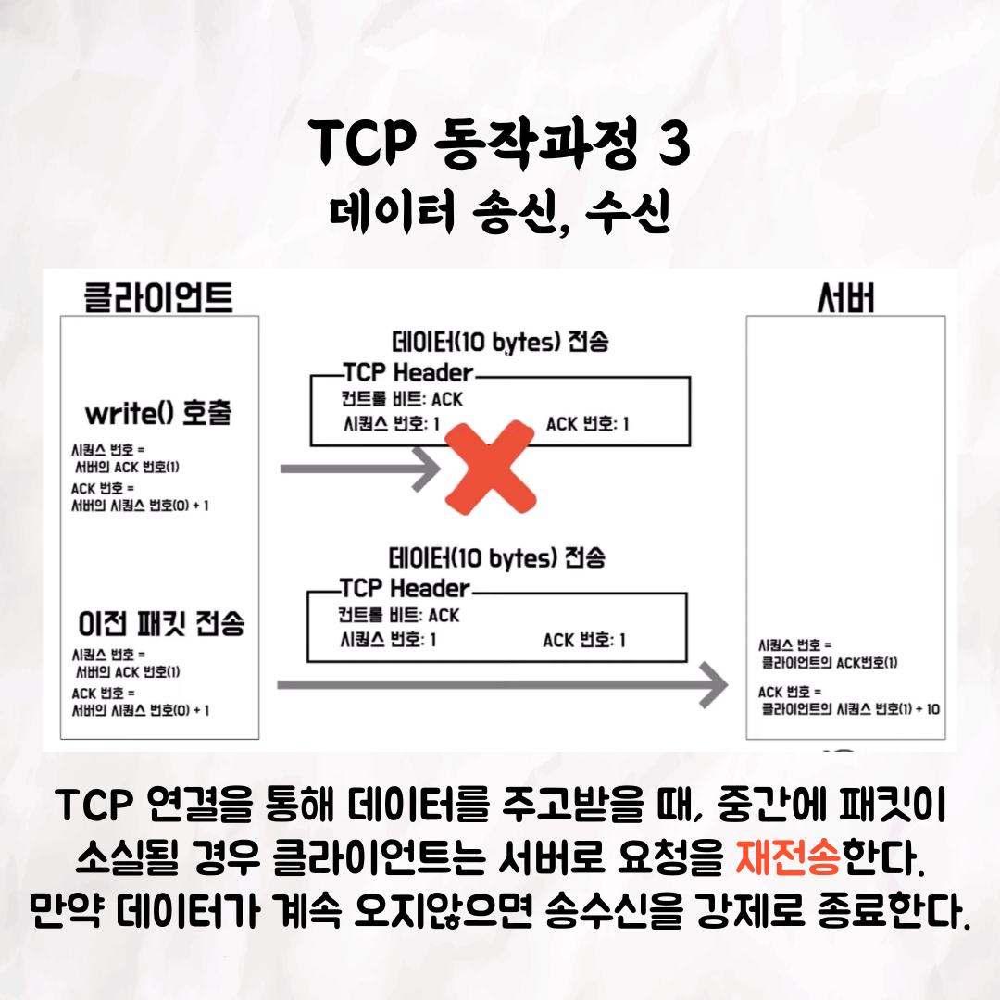
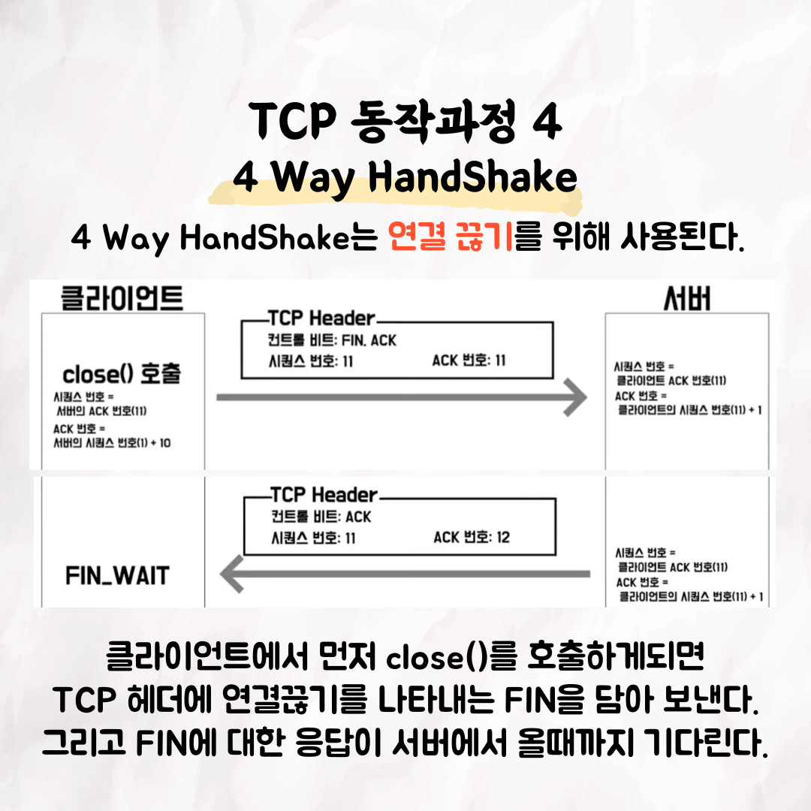
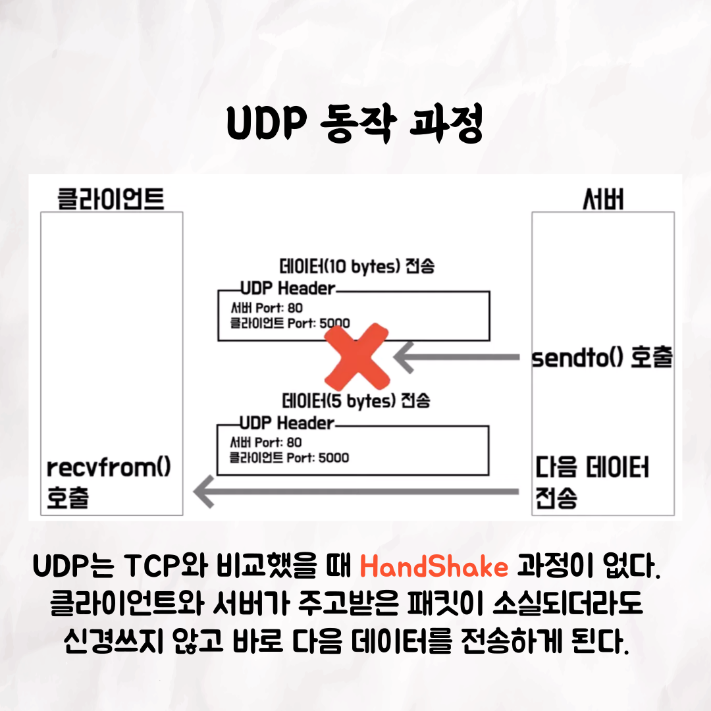
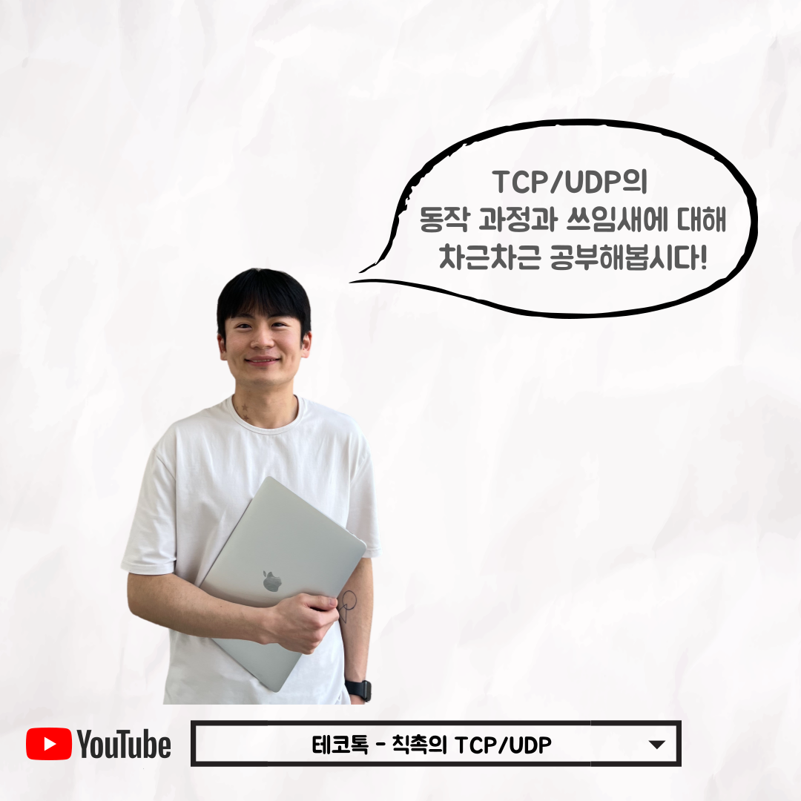

### 테코톡 - 칙촉의 TCP/UDP

📮 테코톡

주제: TCP/UDP

발표자: 칙촉 🍪

TCP와 UDP는 면접 질문으로 자주 등장할 정도로 흔한 개념인데요,  
이번 테코톡에서 다시 한번 개념을 짚어보는건 어떨까요?  

영상은 유튜브에 "칙촉의 TCP/UDP"로 검색하시면 찾아보실 수 있습니다!

우아한Tech 유튜브:https://www.youtube.com/c/%EC%9A%B0%EC%95%84%ED%95%9CTech

우아한테크코스 홈페이지:https://woowacourse.github.io

우테코 블로그(Tecoble):https://tecoble.techcourse.co.kr

#우아한테크코스 #우테코 #테코톡 #tecotalk #java #javascript #spring #react #개발문화 #개발 #개발자 #woowahantechcourse #wooteco #techcourse #함께자라기 #네트워크 #TCP #UDP
