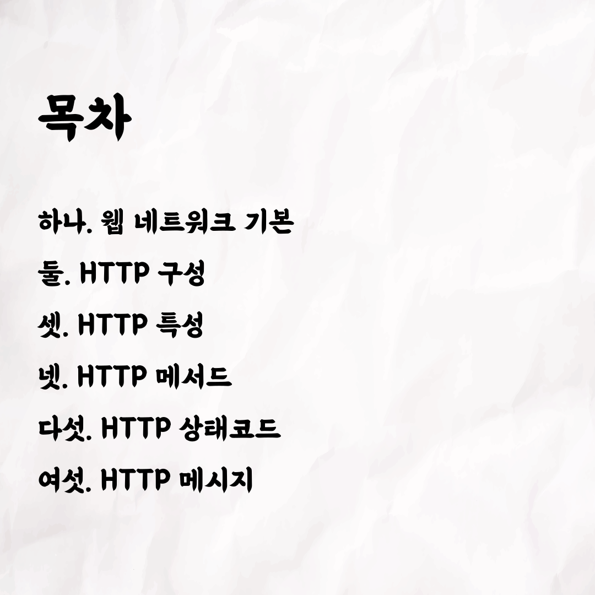
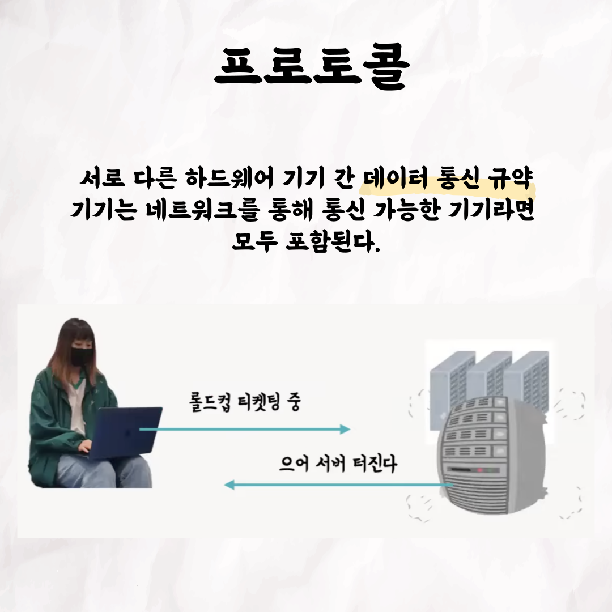
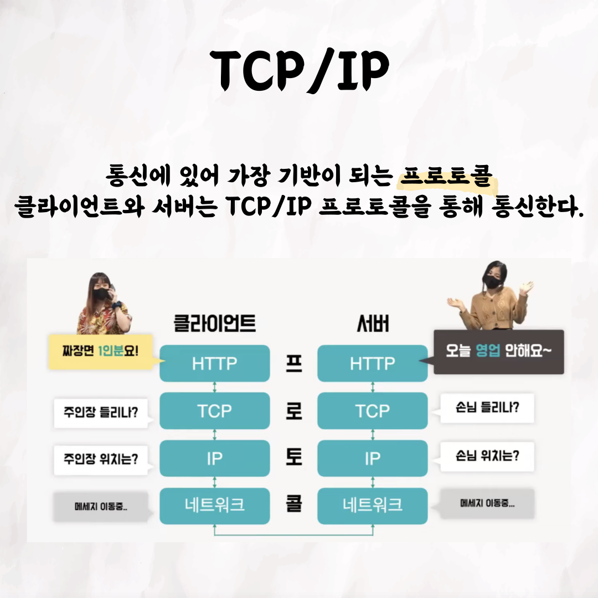
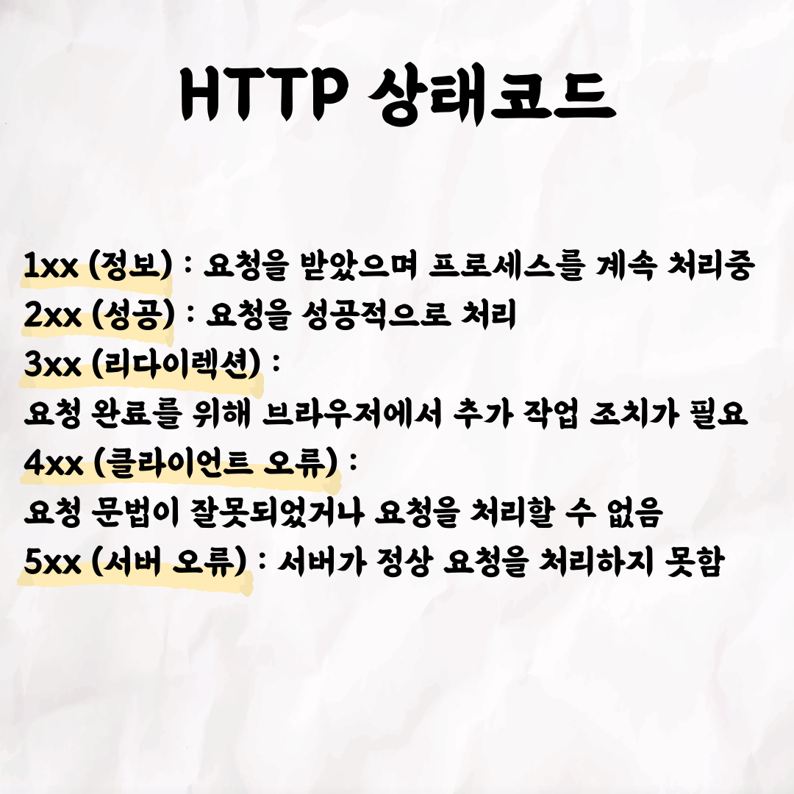

### 테코톡 - 헌치 & 써머의 HTTP

📮 테코톡

주제: HTTP

발표자: 헌치🏝️, 써머🏄

우테코만의 문화인 테코톡에서 헌치와 써머가 HTTP라는 주제로 발표를 해주었어요👏 우리가 평소에 사용하는 인터넷 주소가 http로 시작할 만큼 HTTP는 늘 우리 곁에 있는 기술입니다. 
하지만 HTTP가 어떻게 동작하는지, 어떤 구조로 구성되어있는지는 잘 모르는 경우가 많습니다🧐  
이번 기회에 헌치&써머의 테코톡으로 HTTP를 공부해보는건 어떨까요?

 영상은 유튜브에 "헌치&써머의 HTTP"으로 검색하시면 찾아보실 수 있습니다

우아한Tech 유튜브:https://www.youtube.com/c/%EC%9A%B0%EC%95%84%ED%95%9CTech

우아한테크코스 홈페이지:https://woowacourse.github.io

우테코 블로그(Tecoble):https://tecoble.techcourse.co.kr

#우아한테크코스#우테코#테코톡#개발자#java#javascript#spring#react#개발문화#개발#개발자#woowahantechcourse#wooteco#techcourse